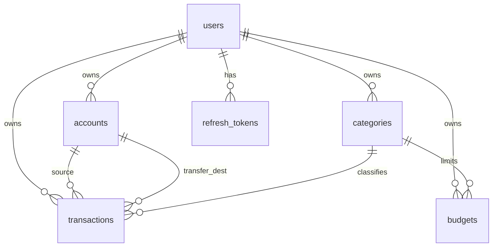

# FinTrack — gestor de finanzas personales full-stack (Spring Boot + Flutter, 100% local)

[](https://openjdk.org/)
[](https://spring.io/projects/spring-boot)
[](https://flutter.dev/)
[](https://www.postgresql.org/)
[](LICENSE)

Registra ingresos y gastos, administra presupuestos mensuales y visualiza reportes. Backend REST con JWT, cliente Flutter multiplataforma, base de datos PostgreSQL en Docker. Proyecto de aprendizaje full-stack y pieza de portafolio.

## Demo

> **Tip:** reemplaza `docs/images/demo.gif` con una grabación de 15–30 s (registrar gasto → lista → dashboard → presupuestos). Mantén el archivo bajo ~5 MB.


| Dashboard | Transacciones | Alta de transacción |
|:---:|:---:|:---:|
|  |  |  |
| Presupuestos | Reportes | Swagger UI |
|  |  |  |

## Características

- **Autenticación JWT** con access token (15 min) y refresh token rotativo (7 días).
- **Cuentas** (efectivo, débito, crédito, ahorro) con saldo calculado en tiempo real.
- **Categorías** de ingreso/gasto con iconos y colores; siembra automática al registrarse.
- **Transacciones** — ingreso, gasto y transferencia entre cuentas propias, con filtros y paginación.
- **Presupuestos mensuales** por categoría con barras de progreso y alertas por color.
- **Dashboard** — balance total, resumen del mes, top presupuestos y últimas transacciones.
- **Reportes** — resumen mensual, desglose por categoría, tendencia de 6 meses y exportación CSV.
- **Tema claro/oscuro** con Material 3 en Flutter.
- **100 % local** — sin servicios cloud; PostgreSQL corre en Docker.

## Stack

| Capa | Tecnología | Versión |
|---|---|---|
| Frontend | Flutter (Dart) | 3.x |
| Estado | Riverpod | 2.x |
| Backend | Java + Spring Boot | 21 / 3.3+ |
| ORM | Spring Data JPA | — |
| Base de datos | PostgreSQL | 16 |
| Migraciones | Flyway | — |
| Auth | JWT (access + refresh) | — |
| Docs API | springdoc-openapi | — |
| Orquestación | docker-compose | — |
| Tests backend | JUnit 5 + Testcontainers | — |
| Tests frontend | flutter_test | — |

## Arquitectura

```
┌─────────────────┐     HTTP/JSON      ┌──────────────────────┐      JDBC      ┌────────────┐
│  Flutter App     │ ◄───────────────► │  Spring Boot API      │ ◄────────────► │ PostgreSQL │
│  (mobile/desktop)│   localhost:8080  │  (REST, JWT, Flyway)  │                │  (Docker)  │
└─────────────────┘                    └──────────────────────┘                └────────────┘
```

### Backend (`com.fintrack`)

```
backend/src/main/java/com/fintrack/
├── config/          # Seguridad, CORS, OpenAPI
├── auth/            # Login, registro, refresh, JWT
├── account/         # Cuentas y saldo calculado
├── category/        # Categorías
├── transaction/     # Transacciones (núcleo)
├── budget/          # Presupuestos mensuales
├── report/          # Agregaciones y CSV
├── dev/             # Seed de datos de demo (perfil dev)
└── common/          # Excepciones, Problem Details
```

### Flutter (`app/lib`)

```
app/lib/
├── core/            # Tema, router, Dio + interceptores JWT
├── features/
│   ├── auth/
│   ├── dashboard/
│   ├── transactions/
│   ├── accounts/
│   ├── categories/
│   ├── budgets/
│   ├── reports/
│   └── settings/
└── shared/          # Widgets, formatters, strings
```

## Cómo ejecutar

### Opción A — todo en Docker (demo con un comando)

```bash
cp docker/.env.example docker/.env
# Genera JWT_SECRET (256 bits):
openssl rand -base64 48
# Pega el valor en docker/.env

docker compose -f docker/docker-compose.yml --profile full up --build
```

Espera a que ambos servicios estén healthy, luego:

```bash
curl http://localhost:8080/api/v1/actuator/health
# {"status":"UP"}
```

Swagger UI: [http://localhost:8080/api/v1/swagger-ui.html](http://localhost:8080/api/v1/swagger-ui.html)

### Opción B — desarrollo (IDE)

Solo la base de datos en Docker; backend y Flutter desde tu máquina.

```bash
cp docker/.env.example docker/.env
# Configura JWT_SECRET como arriba

docker compose -f docker/docker-compose.yml up -d db

cd backend && ./gradlew bootRun
cd app && flutter run
```

**Emulador Android:** el host no es `localhost`. Usa:

```bash
flutter run --dart-define=API_BASE_URL=http://10.0.2.2:8080/api/v1
```

**Puerto de Postgres en desarrollo:** el compose publica Postgres en `localhost:5435` (host) → `5432` (contenedor). Si no tienes conflicto con otro Postgres local, puedes cambiar el mapeo a `5432:5432` en `docker/docker-compose.yml` y ajustar `DB_URL` en `backend/src/main/resources/application.yml`.

### Perfiles de Docker Compose

| Comando | Servicios | Uso |
|---|---|---|
| `docker compose -f docker/docker-compose.yml up -d db` | Solo Postgres | Desarrollo con Spring/Flutter en el IDE |
| `docker compose -f docker/docker-compose.yml --profile full up --build` | Postgres + API | Demo de un comando, CI, revisores |

Los datos persisten en el volumen `fintrack_pgdata` entre `down` y `up`.

## API

- **Base URL:** `http://localhost:8080/api/v1`
- **Swagger UI:** [http://localhost:8080/api/v1/swagger-ui.html](http://localhost:8080/api/v1/swagger-ui.html)
- **OpenAPI JSON:** [http://localhost:8080/api/v1/v3/api-docs](http://localhost:8080/api/v1/v3/api-docs)
- **Colección de ejemplos:** [`docs/api/fintrack.http`](docs/api/fintrack.http) (REST Client / IntelliJ)
- **OpenAPI exportado:** [`docs/api/openapi.json`](docs/api/openapi.json)

Credenciales de demo sugeridas para la colección `.http`: `demo@fintrack.local` / `demo12345`.

Con perfil `dev` activo, `POST /api/v1/dev/seed` siembra 6 meses de transacciones de ejemplo para el usuario autenticado.

## Modelo de datos



**Reglas clave:** saldo de cuenta = `initial_balance` + movimientos (calculado, no persistido). Transferencias = una sola fila con cuenta destino. Presupuestos solo en categorías `EXPENSE`.

Spec completo: [`PLAN_MAESTRO_FINTRACK.md`](PLAN_MAESTRO_FINTRACK.md).

## Decisiones de diseño

- **`BigDecimal` / `Decimal`, nunca `double` para dinero.** Los floats binarios acumulan error de redondeo (`0.1 + 0.2 ≠ 0.3`). En Java usamos `BigDecimal` con `DECIMAL(14,2)` en Postgres; en Dart el paquete `decimal`. El costo es verbosidad al parsear y serializar montos como strings en JSON, pero garantiza que $1,234.50 + $0.01 sea exactamente $1,234.51 en cualquier capa.

- **Saldos calculados, no persistidos (RB-01).** El saldo se obtiene con una query de agregación sobre transacciones + `initial_balance`. Sacrificamos lecturas O(1) a cambio de una única fuente de verdad: no hay riesgo de que el saldo cacheado diverja del historial. Para una app personal con miles de movimientos, el costo de agregación sigue siendo aceptable; escalaría mal a millones de filas sin índices/materialized views, pero eso está fuera del alcance v1.

- **Transferencia como fila única (RB-03).** Una transferencia es un registro con `type=TRANSFER` y `transfer_account_id`, no dos movimientos espejo. Simplifica el modelo y evita inconsistencias (¿qué pasa si solo se inserta la mitad?). El trade-off: los reportes de ingreso/gasto deben excluir transferencias explícitamente, y el saldo de cada cuenta debe interpretar el signo según si es origen o destino.

- **Refresh tokens rotativos con hash en BD.** Guardamos solo el hash SHA-256 del refresh token, no el valor en claro. Cada refresh invalida el token anterior y emite uno nuevo (rotación). Si alguien roba un refresh token ya usado, detectamos reutilización y revocamos la cadena. El costo: una escritura extra por refresh y complejidad en el cliente (persistir el nuevo refresh token tras cada renovación).

- **Flyway + `ddl-auto: validate`.** El esquema lo define el SQL versionado (`V1__init.sql`, etc.), Hibernate solo valida al arrancar. Sacrificamos la comodidad de auto-generar tablas en desarrollo a cambio de migraciones reproducibles en Docker, CI y producción. Un cambio de entidad sin migración Flyway falla al boot — es incómodo, pero evita sorpresas en despliegue.

- **Testcontainers con Postgres real, no H2.** H2 no replica el dialecto ni las constraints de Postgres (CHECK, tipos `DECIMAL`, funciones de fecha). Testcontainers levanta un Postgres efímero por suite de integración: tests más lentos (~segundos extra) pero confianza de que las queries nativas (reportes, saldos) se comportan igual que en producción.

## Tests

```bash
# Backend: Spotless, Checkstyle, unit + integration tests, cobertura ≥80% en servicios
cd backend && ./gradlew check

# Flutter: analyze + widget tests
cd app && flutter analyze && flutter test

# Todo junto
./scripts/check.sh
```

**Backend:** tests unitarios de servicios (reglas RB-01–RB-05), tests de integración de controllers con Testcontainers (auth, transacciones).

**Flutter:** widget tests de formulario de transacción, barra de progreso de presupuestos y formato de moneda.

## Roadmap / fuera de alcance (v1)

Estas ausencias son decisiones conscientes, no pendientes olvidados:

- Sincronización multi-dispositivo / modo offline-first
- Conexión a bancos o scraping de movimientos
- Notificaciones push
- Multi-moneda con tipos de cambio en tiempo real

## Estructura del repo

```
fintrack-java-flutter/
├── backend/       # API Spring Boot (Gradle, Java 21)
├── app/           # Cliente Flutter
├── docker/        # docker-compose.yml + .env.example
├── docs/          # API (.http, OpenAPI), imágenes de demo
├── plans/         # Plan de implementación por fases
└── scripts/       # check.sh — lint + tests
```

## Licencia

MIT — ver [`LICENSE`](LICENSE).
